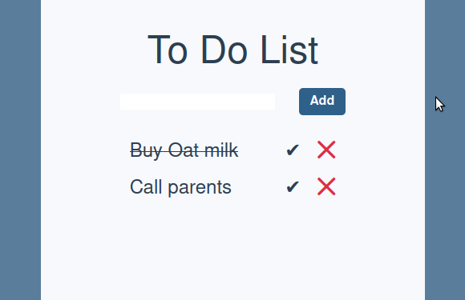

# Todo List App

This is a simple Todo List app built with Vue 3, Tailwind CSS, Pinia, and Vite. The purpose of this project is to serve as a learning tool for the author to learn Vue 3 and state management with Pinia.
It is very barebones at the moment, but the author plans to add more features and functionality in the future and possibly a complete rewrite using Vuetify.

**Screenshot**

    

### What I learned

- **Differences between Vue and React**:
  - **Template vs JS**X: Vue uses templates, which allow developers to define HTML-like syntax for their component's structure and rendering. React, on the other hand, uses JSX, which allows developers to write JavaScript code that defines their component's structure and rendering.
  - **Reactivity**: Vue's reactivity system is more straightforward and intuitive than React's. Vue automatically tracks changes to data and updates the view accordingly, while React requires developers to manually manage state and use methods like setState() to trigger re-renders.
  - **Component Composition**: allows developers to organize their component logic in a more scalable and reusable way, making it easier to share code across components. React has its own set of techniques and patterns for component composition.
  - **Ease of Learning**: Vue has a simpler and more intuitive API than React. Vue also offers a more consistent and opinionated framework, while React is more flexible but requires more setup and configuration.
  - **Community and Ecosystem**: React has a larger and more established community and ecosystem than Vue, with more third-party libraries, tools, and resources available. However, Vue has been growing in popularity in recent years and has a strong and supportive community.
- **Vue 3**: components, directives, data binding, event handling
  - **Composition API**: functions and objects to define component logic
  - **New reactivity system**: uses Proxies, a leaner template compiler, and better static analysis for template rendering
  - **Better TypeScript support**: better type inference, better type checking, and better type errors
  - **Global API**: more consistent and intuitive way to access Vue functionality
- **Pinia**: state management, reactive data, stores, actions, mutations

## Features

- Add new tasks to the list
- Mark tasks as completed or uncompleted
- Delete tasks from the list

### Getting Started

#### Prerequisites

Node.js (v16 or higher) and npm (v7 or higher)

#### Installing

- Clone this repository
- Navigate to the project directory in your terminal
- Run npm install to install the dependencies
- Run npm run dev to start the development server
- Open your browser and go to http://localhost:3000

#### Building for Production

Run npm run build to build the production-ready code
The output will be generated in the dist folder

### Technologies Used

- [Vue 3](https://vuejs.org/) - The progressive JavaScript framework for building user interfaces
- [Tailwind CSS](https://tailwindcss.com/docs/installation) - A utility-first CSS framework for rapidly building custom designs
- [Pinia](https://pinia.vuejs.org/) - A state management system for Vue.js
- [Vite](https://vitejs.dev/) - A build tool that provides a faster and leaner development experience

### Credits and Acknowledgments

This project was inspired by [todo-pinia](https://github.com/deepgram-devs/todo-pinia/tree/main) and Vue 3 Todo List Tutorial.

Thanks to Vue.js, Tailwind CSS, Pinia, and Vite teams for providing excellent tools and documentation.

Thanks to Vue Mastery for providing great tutorials and courses

.
